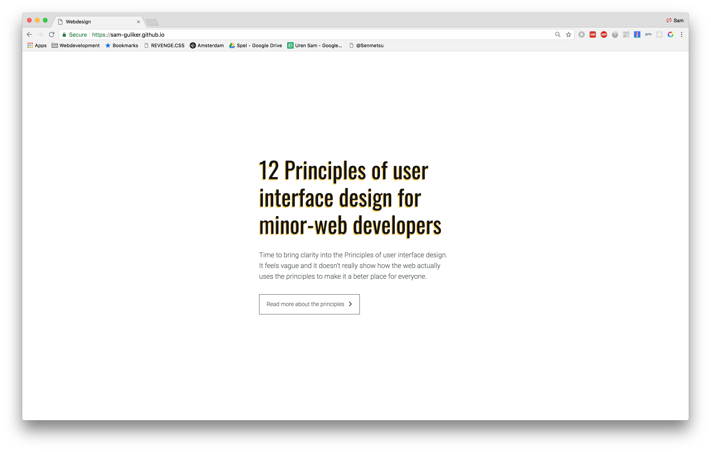
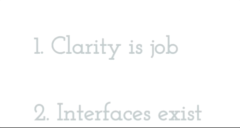

# Webdesign
For this topic I have to look at who the users are and create an exclusive website for them.

[The App](https://sam-guliker.github.io/webdesign/app/index.html)



# Table of Content
* [Getting started](#getting-started)
* [Users](#users)
* [User Scenario](#user-scenario)
* [Testing](#testing)
    * [Test results](#test-results)
* [Principles of User Interface Design](#principles-of-user-interface-design)
    * 2. Interfaces exist to enable interaction
    * 3. Conserve attention at all costs
    * 10. Consistency matters
    * 11. Strong visual hierarchies work best
    * 13. Highlight don’t determine with color
    * 14. Progressive Disclosure
* [Conclusion Webdesign](#conculsion-webdesign)
* [Web app from scratch](#web-app-from-scratch)
    * [HyperHTML](#hyperhtml)
    * [Sass](#sass)
    * [Learning Process](#learning-process)
    * [Wishlist](#wishlist)
    * [Conclusion](#conclusion)

# Getting Started
How to get started with this project:
1.  Clone the repo with `git clone https://github.com/Sam-Guliker/minor-vangogh` or download it from github
2.  Run `npm install`  to install the dependencies
3.  Run `npm start` to start the server
4.  Go to [http://localhost:3000/](http://localhost:3000/)

# Users: 
Everything Web students.

# User Scenario
I want to make sure that topics of principles of user interface  
design are clear to students of the everything web minor, the principles   
do not remain vague.

# Testing
I've tested with my minor students.

* Jamie
* Kevin
* Vincent

## Test results
### Jamie
> Make the text lines smaller and maybe you can put it next to each other.  -Jamie

What he means by this is to go from one column to  
two column, so you can create more space for the content and  
make the text more readable.

### Kevin
> The website list feels "choppie". Kevin

This is due to the margins that have to be adjusted and there is no animation on the content block.

### Vincent
> EImage only examples do not work properly.

Vincent is right, it is handy to add a description.

### Feedback
* [x] Make a two column layout when you open the content.
* [x] Give consistent marigins.
* [x] Make sure the examples are also having a  description.

# Principles of User Interface Design
During the design and construction of the website, I applied several principles.  
The principles are intended to help the user on the website.

## 2. Interfaces exist to enable interaction
I make sure that the user can use simple interaction to get more information about the topics.  



## 3. Conserve attention at all costs
There is no distraction in the application the user can go through  
the application without being disturbed.

## 10. Consistency matters
The padding, margin, color, font colour, images are equal or have the  
same size, making the website look peaceful.

## 11. Strong visual hierarchies work best
Through the layout and font size, the user is easily guided through the web page.

## 13. Highlight don’t determine with color
I use color and size to attract attention on the website. I do this by using the `box-shadow`.

## 14. Progressive Disclosure
By using progressive disclosure I ensure that the user only sees more  
information when he/she is interested in the subject.


# Conclusion Webdesign
Through exclusive design and the principles that have been added, I am  
very satisfied with my delivery. The only thing I want to add  
is more of a CMD like feel. It is now aimed at  
the minor web development but the style is very much based on  
minimalism, and I think there could be an extra layer of style  
over it to make it feel more exclusive.

Guidelines are helpful, but with good design there are also enough reasons to __break__ the rules.

# Web app from scratch
To complement the web app from scratch, I chose to make it more  
modular and give it a more "app" feel. During this process I 
discovered that sometimes it is difficult to apply the right techniques client-side.  
I'll elaborate on that in more detail in a moment.

## HyperHTML
To make it more modular and make it look like an app,  
I used `hyperHTML`. [HyperHTML](https://github.com/WebReflection/hyperhtml) is a micro-lib that helps with these tasks.
In addition, I also used the [hyperhtml-app](https://github.com/WebReflection/hyperhtml-app). Hyperhtml app ensures that  
the routing is handled, this looks like how express does its routing.

I also want to give a special thanks to [Kevin](https://github.com/kyunwang)
with helping me with indexing the data.

<details>
    <summary>Component based</summary>

    ```javascript
        const { hyper } = hyperHTML
        import app from './navigate-app.js'

        class Introduction extends hyper.Component {

            click(e) {
                app.navigate('/principles');
                e.preventDefault();
            }
            render() {
                return this.html`
                <main>
                    <div class='container'>
                    <h1>12 Principles of user interface design for minor-web developers</h1>
                    <p>
                        Time to bring clarity into the Principles of user interface design.
                        It feels vague and it doesn’t really show how the web actually uses the principles
                        to make it a beter place for everyone.
                    </p>
                    <a class='btn' href='' onclick=${this.click}> Read more about the principles <i class='fa fa-chevron-right' aria-hidden='true'></i></a>
                    </div>
                </main>
                `
            }
        }

        hyper(document.body) `${new Introduction}`;

    export default Introduction 
    ```

</details>

<details>
    <summary>Template rendering</summary>
    <p> By mapping my data, I get back objects containing the corresponding data. This is because I include an index.</p>

    ```javascript
        <ul class='container list'>
            ${data.map((item, i) => wire(item)
            `<li>
            <a href='#' onClick=${(e) => this.handleChange(e, i)}><h2 class=${show ? 'selected' : ''}>${item.name}</h2></a>
            <section class=${(index === i && show) ? 'selected' : ''}>
                <div>
                    <p>${item.explain}</p>
                </div>
                <div>
                    <h3>Example:</h3>
                    <p class="context-padding">${item.context}</p>
                    
                    <a href='https://codepen.io/' target='blank'class='btn inline-block'> Another example link <i class='fa fa-chevron-right' aria-hidden='true'></i></a>
                </div>                   
            </section>
            </li>`)
        }
        </ul>
    ```

</details>

<details>
    <summary>States</summary>
    <p>States are a powerful tool to bring your app to the next level. With states you simply say a start state and the next state. You can make it more complex by adding more states if you want to.</p>

    ```javascript

    constructor(show) {
        super();
        this.setState({ show: false });
        this.setState({ index: null });
    }

    handleChange(e, i) {
        const { show, index } = this.state

        if (show && index === i) {
            this.setState({
                show: !this.state.show,
            })
        } else if (show && index !== i) {
            this.setState({
                index: i
            })
        } else {
            this.setState({
                show: !this.state.show,
                index: i
            })
        }
        e.preventDefault()
    }

    ```

</details>

# Sass
My scss has been structured in such a way that it is  component based.  
I have gone so far that the media queries are also in the same rules.  
I've noticed that applying this will make it easier to go through the files. 


<details>
    <summary>Sass</summary>

    ```css
        .container.list {
            @media (min-width: $media-tablet) {
                width: 100%;
                margin: auto;
            }
            a {
                display: block;
                font-weight: 100;
                transition: 0.4s all ease;
                font-family: $font-text;

                &:hover,
                &:focus{
                    transform: matrix(1, 0, 0, 1, 0, 0);
                    outline: 0;
                }
                &:hover h2,
                &:focus h2 {
                    color: $headline-base;
                    transition: 0.3s color ease;
                    transform: matrix(1.05, 0, 0, 1.05, 0, 0);
                }
            }
            li section {
                display: block;
                max-height: 0;
                overflow: hidden;
                margin:0 1em;
                transition: (max-height 0.4s ease-out);
                &:last-of-type {
                    margin-bottom: 2vw;
                }
                @media (min-width: $media-tablet) {
                    margin: 0 14vw;
                }
                @media (min-width: $media-desktop) {
                    display: flex;
                }
                div {
                    @media (min-width: $media-desktop) {
                        max-width: 50%;
                        margin-right: 3rem;
                    }
                    .context-padding {
                        padding-top: 1rem;
                    }
                }
            }
            li h2 {
                transition: 0.4s transform ease-in-out;
                color:$off-focus;
                font-size: 2rem;
                margin: 2rem 1rem;
                cursor: pointer;
                @media (min-width: $media-tablet) {
                    font-size: 10vw;
                    margin: 14vw;
                    margin-bottom: 2vw;
                }
            }
        }

    ```

</details>

# Learning Process
Because hyperHTML does not have as large a community as react or  
angular, fewer packages are available to make functionality easier.  
I still wanted to pair APIs but it became quite complex because of the use of hyperHTML.

# Wishlist
I wanted to use the [Intersection observer api](https://developer.mozilla.org/en-US/docs/Web/API/Intersection_Observer_API), unfortunately this became quite 
difficult by using hyperHTML.

- [ ] Intersection observer API
- [ ] CommonJS

# Conclusion
Using hyperHTML and hyperhtml-app, I raised my "modular" game.  
I would have liked to add some APIs, but I am very satisfied with the result.
